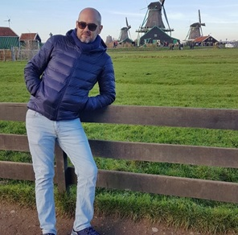
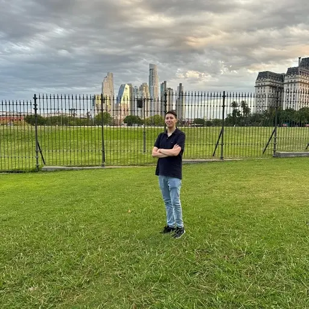
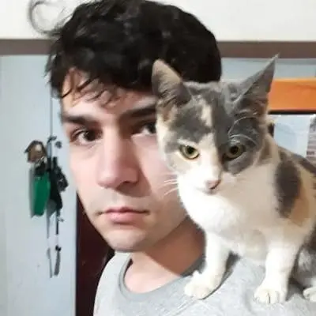
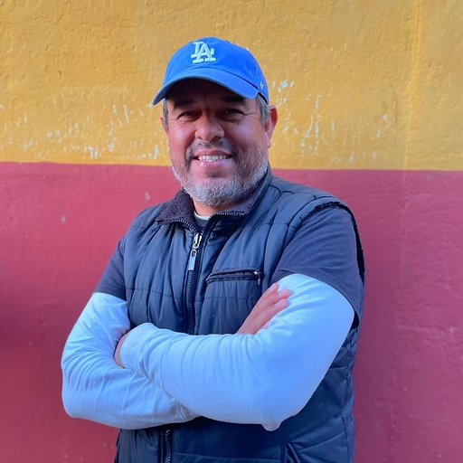

# Artesanías Marketplace

Artesanías Market is the ideal e-commerce for entrepreneurs who want to market their handicraft products in an easy and effective way.

# Build
### Dependencies

- node.js > v20.12.2
- postgresql

# Proyect summary
## BackEnd

Development of a custom API REST app in express.js:
- Implemented with: Sequelize ORM and JSON Web Tokens.
- Implemented the creation and manipulation of Users, Stores, Categories, Products and Transactions resources.
- Implemented a proper API documentation in `/backend/docs`

## Developers

|                            |                            |
| :--------------: | :------------------: |
| **Ricardo Díaz** | **Javier Pignataro** |
|       |       |

## FrontEnd

### Descripcion y funcionalidades

- Desarrollo de vistas mediante componentes dinámicos con Javascript y React.
- Agregar estilos con Material UI y TailwindCSS
- Creación de las rutas enlazadas de la página usando React router
- Axios y Redux para controlar la información de base de datos
- Subir imagenes de los productos y/o tiendas usando Firebase
- PopUps atractivos y animados usando SweetAlert
- Deploy con Vercel

### Developers

|                            |                         |                              |
|  :--------------:  |  :------------------:  |  :--------------:  |
| **Daniel Agudelo** | **Oscar Frias Viñals** | **Lucas Bernaola** |
|       |       |       |

## Tests

### Tester

|                            |
| :-------------: |
| **Franco Ramírez** |
|  |     |

## Infraestructure & DevOps

### Infraestructure Manager

|                            |
| :-------------: |
| **Federico Fernández** |
|   |     |

## UI/UX

[Figma Prototype](google.com)

### Designer

|                            |
| :-------------: |
| **Justina Cid** |
|   |

## Team Leader

|                            |
| :------------: |
| **René Silva** |

## Communication

